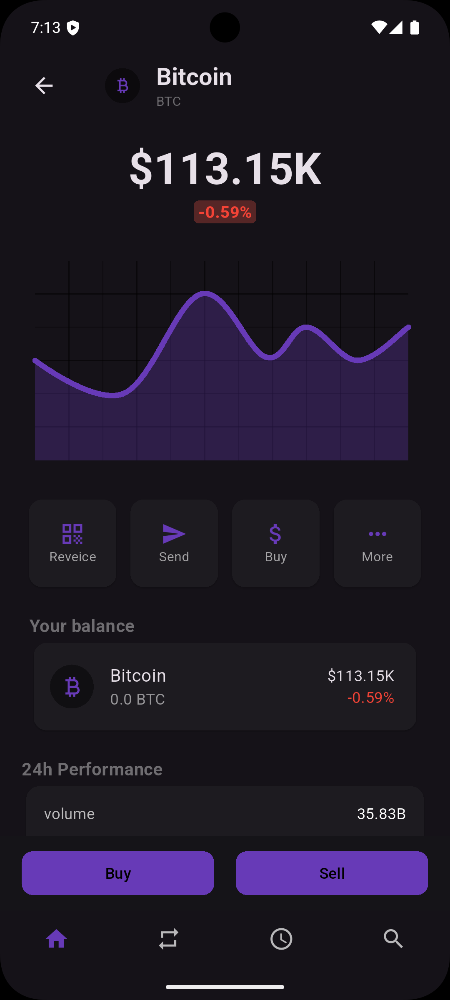
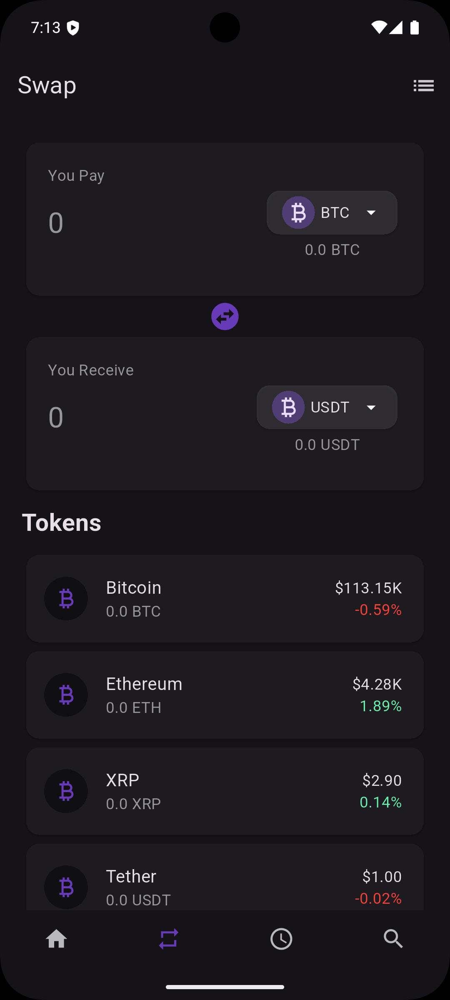

# 📱 Phantom Clone (UI Only)

Clone sederhana dari aplikasi **Phantom Wallet**.  
Proyek ini hanya berfokus pada **UI** dan menampilkan daftar cryptocurrency dengan detail dari API publik.  
⚠️ **Catatan**: Fitur transaksi, autentikasi, dan wallet management belum diimplementasikan.

---

## 🚀 Preview

<p align="center">
  
  
  
  
</p>

---

## ✨ Features

- UI mirip **Phantom Wallet**
- Menampilkan **list cryptocurrency** dari API
- Halaman **detail coin** dengan informasi harga & market
- Responsive & clean design

---

## 🛠️ Tech Stack

- **Flutter** (UI & State Management)
- **Riverpod** (state management)
- **HTTP** (fetch data dari API)
- **Coinlore API** (https://www.coinlore.com/cryptocurrency-data-api)

---

## 📦 Installation

Clone repositori ini:

```bash
git clone https://github.com/username/phantom-clone.git
```

### Install dependencies:

```bash
flutter pub get
```

### Jalankan aplikasi di device/emulator:

```bash
flutter run
```

## 📦 Build APK

### Untuk menghasilkan file .apk:

```bash
flutter build apk --release
```

### File akan tersedia di:

```swift
build/app/outputs/flutter-apk/app-release.apk
```

## 🛠️ Struktur Proyek

```bash
lib/
 | data/             # semua storage data
 |  |-- classes/     # class yang saya gunakan untuk data
 |  |-- provider/    # provider untuk pendataan
 |  |-- notifier     # notifier untuk menyimpan data di memory
 | views/            # semua storage tampilan
 |  |-- pages/       # storage untuk pages/halaman
 |  |-- widget/      # storage untuk widget
 | main.dart         # Entry point
```

## ⚠️ Notes

- Project ini hanya berfokus pada UI & API display

- Belum ada fitur login, wallet connect, ataupun transaksi

- Bisa dikembangkan lebih lanjut karna belum punya api untuk cryptonya

## 📄 Lisensi

### Project ini menggunakan lisensi MIT – silakan gunakan, modifikasi, dan sebarkan.
